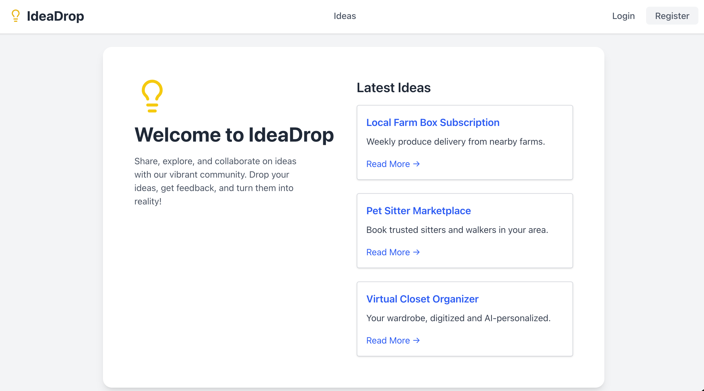

# 💡 IdeaDrop (Frontend)

IdeaDrop is a modern React application that allows users to capture and share their ideas instantly. This repository contains the frontend implementation for the IdeaDrop application, built as part of the "Modern React From The Beginning" course.



## ✨ Features

- **🔐 User Authentication**: Secure registration and login system.
- **🔄 JWT Authentication**: Implements JWT-based auth with automatic token refresh mechanisms.
- **📝 CRUD Operations**: Complete Create, Read, Update, and Delete functionality for ideas.
- **🛡️ Protected Routes**: Secure routing ensures only authenticated users can create or edit ideas.
- **📱 Responsive UI**: A clean and responsive interface designed for various devices.

## 🛠️ Tech Stack

- **⚛️ Framework**: [React](https://react.dev/) (via [Vite](https://vitejs.dev/))
- **🛣️ Routing**: [TanStack Router](https://tanstack.com/router/v1) for type-safe routing.
- **📡 State Management & Data Fetching**: [TanStack Query](https://tanstack.com/query/v5) for efficient server state management.
- **🌐 HTTP Client**: [Axios](https://axios-http.com/) for API requests.

## 🔙 Backend

The backend API for this project is available
[here](https://github.com/51348761z/idea-drop-api).

## 🚀 Getting Started

1. **📥 Clone the repository**

    ```bash
    git clone https://github.com/yourusername/idea-drop-ui.git
    cd idea-drop-ui
    ```

2. **📦 Install dependencies**

    ```bash
    npm install
    # or
    pnpm install
    # or
    yarn install
    ```

3. **🖥️ Run the development server**

    ```bash
    npm run dev
    # or
    pnpm dev
    # or
    yarn dev
    ```

4. **🌐 Open in Browser**
    Visit `http://localhost:5173` (or the port shown in your terminal).
